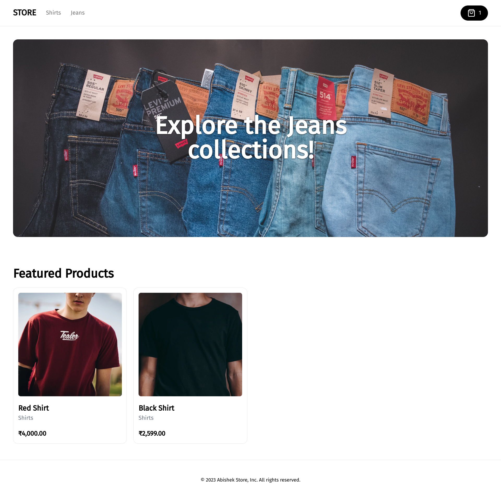
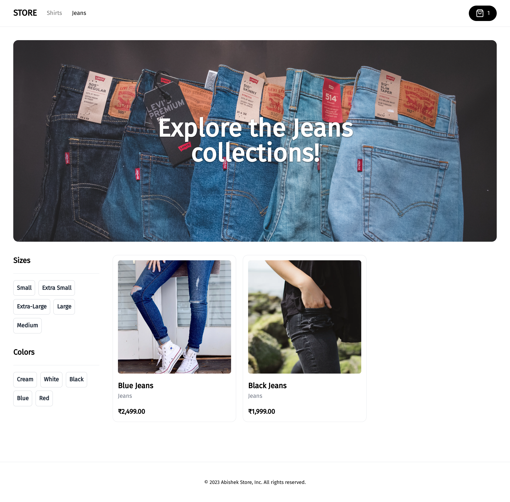
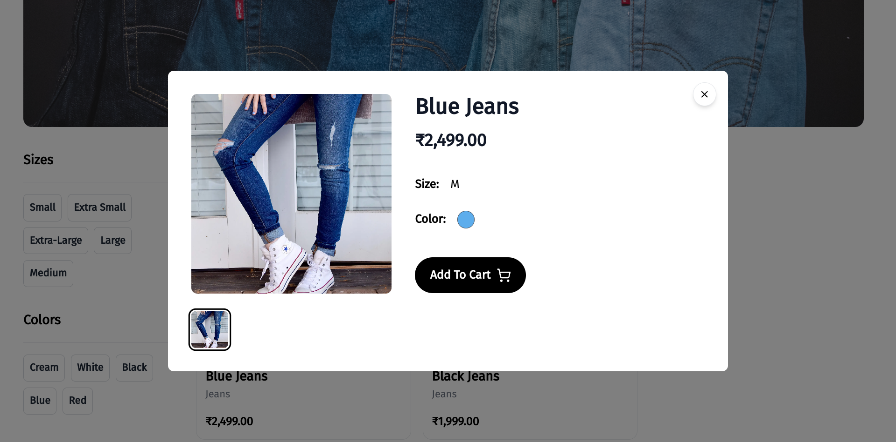
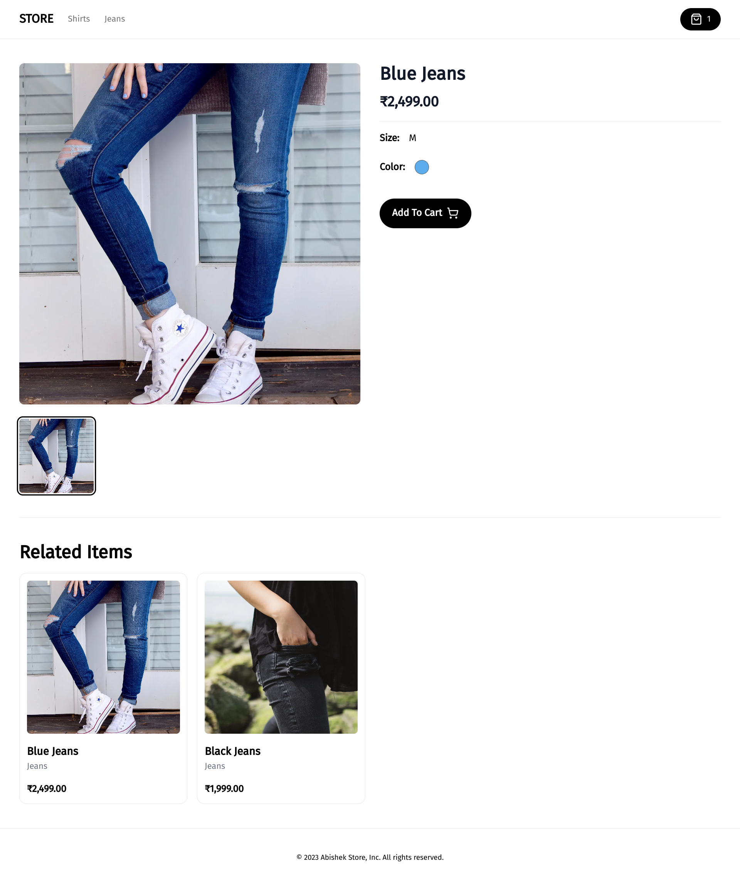
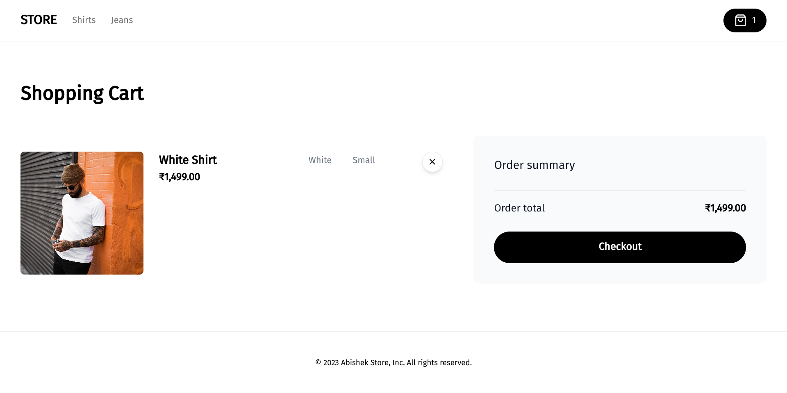

# Dashboard and CMS Live app - https://ecommerce-dashboard-cms.vercel.app/

# Store Live page - https://ecommerce-store-theta-gray.vercel.app/



# Full Stack E-Commerce Frontend: Next.js 13, React, Tailwind CSS

This repository hosts the frontend component of my [Ecommerce-app project](https://github.com/abishek-as/ecommerce-dashboard-cms). The platform showcases a diverse array of products, thoughtfully categorized and complemented by engaging billboards. Furthermore, the application seamlessly incorporates a cart feature, integrated with Stripe for efficient payment processing.

### Prerequisites

**Node version 14.x**

### Cloning the repository

```shell
git clone https://github.com/abishek-as/ecommerce-store
```

### Install packages

```shell
npm i
```

### Setup .env file,

```js
NEXT_PUBLIC_API_URL=
```

Paste the backend URL in NEXT_PUBLIC_API_URL

### Start the app

```shell
npm run dev
```

## Available commands

Running commands with npm `npm run [command]`

| command | description                              |
| :------ | :--------------------------------------- |
| `dev`   | Starts a development instance of the app |

## Images

### Category Homepage



### Short overview of product



### Full overview of product



### Cart


